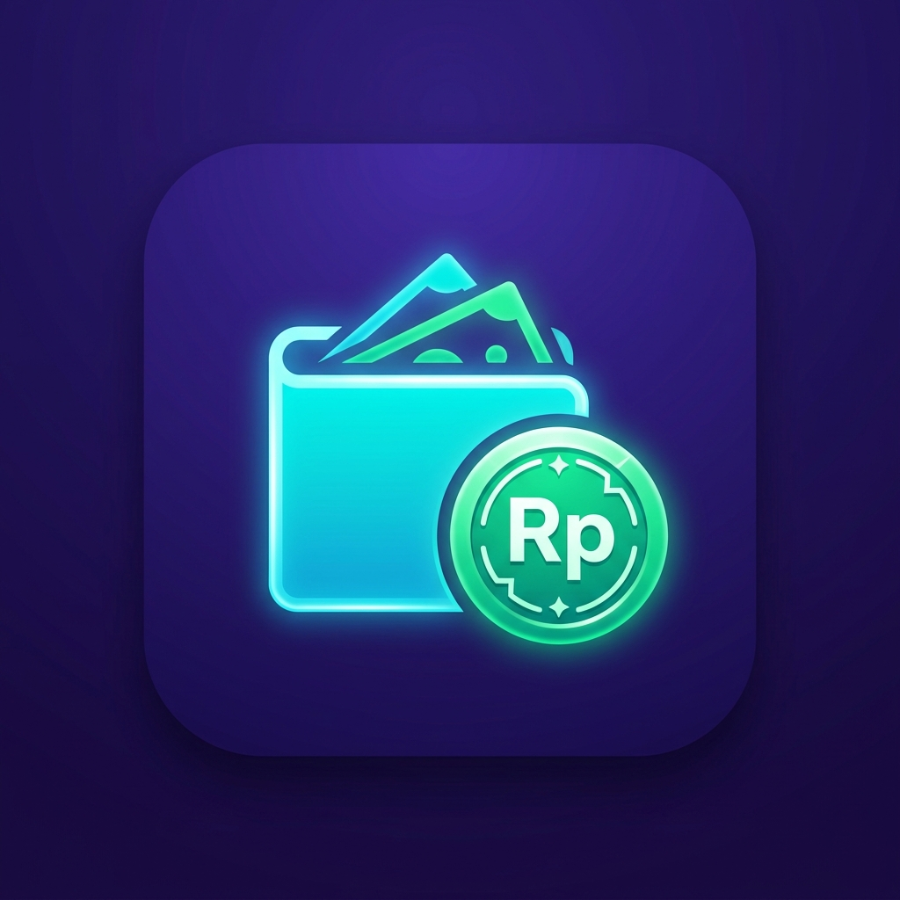

# 💰 UangKu - Personal Finance & AI Receipt Scanner

<p align="center">
  <strong>Aplikasi Pencatatan Keuangan Pribadi Modern, Cepat, Offline-First, dan Didukung AI OCR</strong>
</p>

<p align="center">
  
</p>

---

## 📌 Ringkasan Proyek
**UangKu** adalah aplikasi Android berbasis **Jetpack Compose** dan **Room Database** yang dirancang untuk mempermudah pencatatan keuangan harian tanpa kebisingan iklan dan dengan perlindungan privasi penuh.

- 📖 **Slide / Dokumen Presentasi Lengkap:** Silakan baca file [**`PRESENTASI_UANGKU.md`**](PRESENTASI_UANGKU.md) untuk naskah presentasi, arsitektur, data flow, dan skenario demo aplikasi.

---

## ✨ Fitur Utama
1. **🏠 Beranda & Ringkasan Saldo:** Pantau total saldo bersih, total pemasukan, dan total pengeluaran dalam satu layar.
2. **🧾 Pemindai Struk Berbasis AI (OCR):** Ambil foto struk belanja untuk mengekstrak toko, nominal, tanggal, dan kategori secara otomatis menggunakan Google Gemini Vision.
3. **💳 Catatan Multi-Dompet:** Kelompokkan saldo tunai, rekening bank (BCA, Mandiri, dll.), dan e-wallet (GoPay, OVO, ShopeePay), serta catat alokasi pemindahan internal.
4. **🎯 Target Tabungan (Savings Goals):** Susun target tabungan dengan fitur **Saklar Sinkronisasi Saldo (ON/OFF)**.
5. **📊 Anggaran Kategori (Budgets):** Tentukan batas belanja bulanan dengan peringatan visual saat mendekati batas anggaran.
6. **🔄 Transaksi Rutin (Recurring Bills):** Jadwalkan pengeluaran berkala dengan pengingat notifikasi otomatis.
7. **🗑️ Tempat Sampah (Soft-Delete):** Pulihkan transaksi yang tidak sengaja terhapus.
8. **💾 Cadangan & Ekspor:** Ekspor laporan ke format CSV / Excel, atau ekspor seluruh database ke file JSON / Google Account.
9. **🌙 Mode Gelap & Terang:** Antarmuka Material Design 3 dengan palet warna *Deep Obsidian* dan *Crisp Slate*.

---

## 🛠️ Tech Stack
- **Bahasa:** Kotlin
- **UI Toolkit:** Jetpack Compose (Material 3)
- **Arsitektur:** MVVM (Model-View-ViewModel) + Repository Pattern
- **Database:** Room Persistence Library (SQLite)
- **AI & Jaringan:** Google Gemini Vision API, OkHttp3, Moshi, Retrofit
- **Otentikasi:** Firebase Auth & Google Identity Credential Manager
- **Optimasi Build:** ProGuard / R8 Obfuscation & Code Shrinking

---

## 🚀 Cara Menjalankan Proyek
1. Clone repository ini:
   ```bash
   git clone https://github.com/username/uangku-app.git
   ```
2. Buka folder proyek di **Android Studio** (Koala / Ladybug atau versi terbaru).
3. Buat file `.env` di direktori utama proyek (jika ingin mengaktifkan Gemini AI):
   ```env
   GEMINI_API_KEY=your_gemini_api_key_here
   ```
4. Build dan jalankan aplikasi pada emulator atau perangkat Android (Min SDK 24 / Android 7.0+).

---

## 📄 Lisensi
Hak Cipta © 2026 UangKu Team. Dibuat untuk pencatatan keuangan pribadi yang transparan dan privat.
